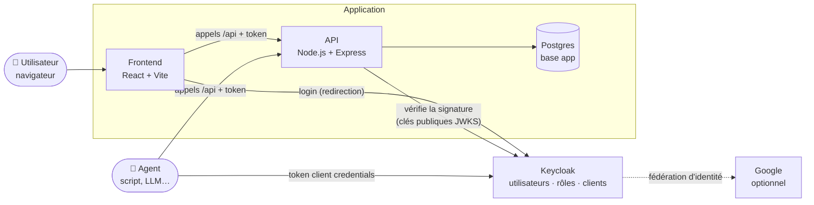
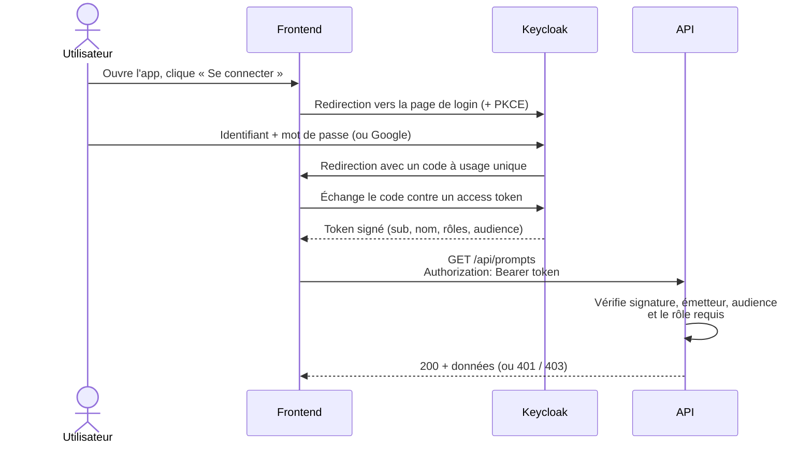
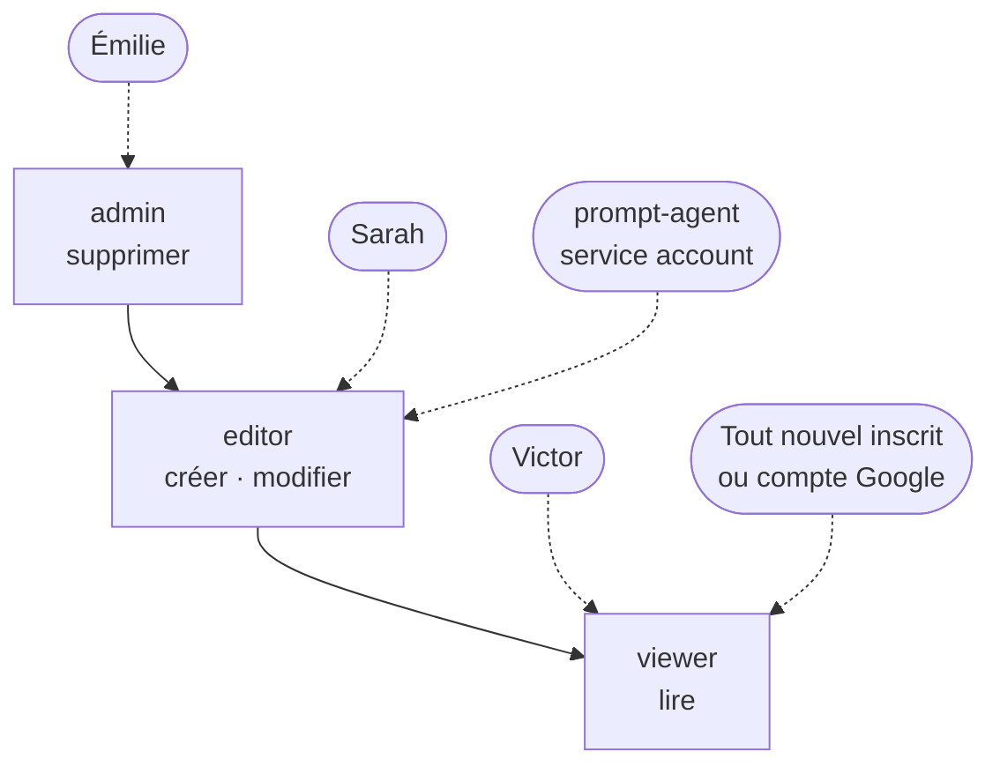
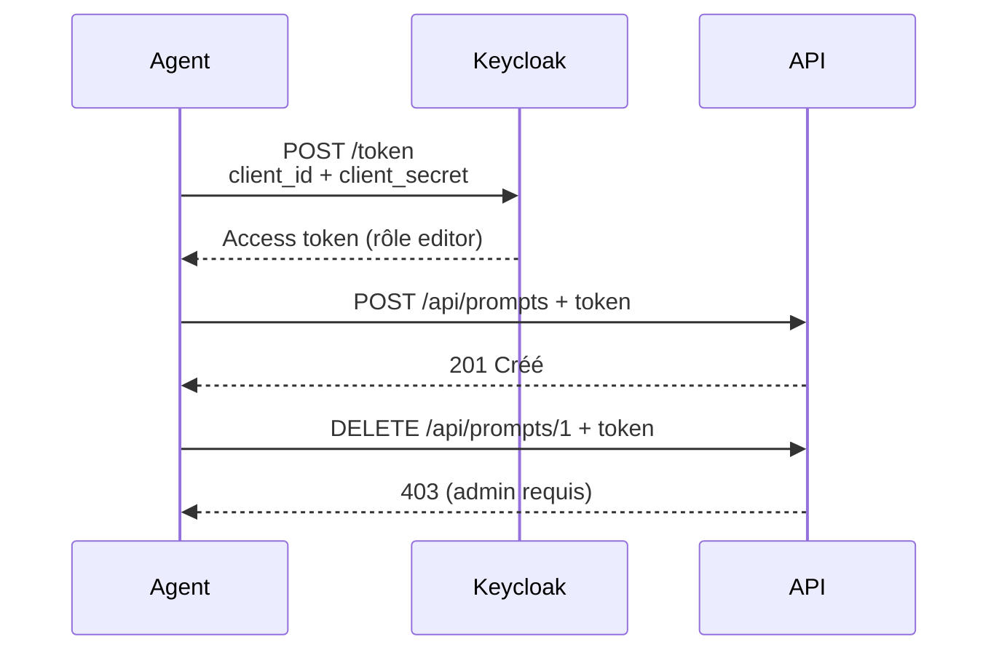
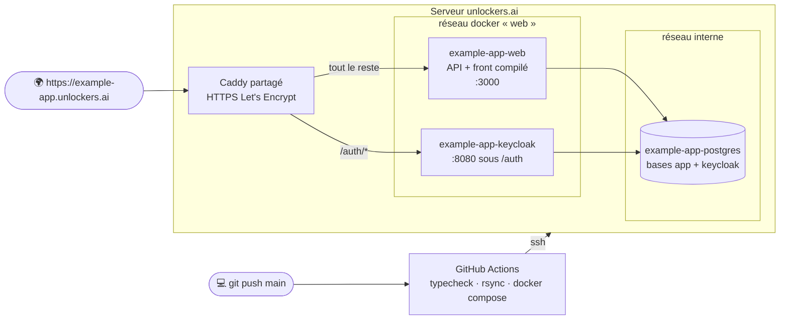

# Architecture

Quatre schémas pour comprendre l'application : les briques, la connexion d'un utilisateur,
l'accès d'un agent, et ce qui tourne en production.

## 1. Les briques

Trois briques : le **front** (ce que voit l'utilisateur), l'**API** (les données et les règles),
et **Keycloak** (qui est qui, et qui a le droit de faire quoi). Le front et l'API ne gèrent jamais
de mot de passe : ils font confiance aux tokens signés par Keycloak.

## 2. Connexion d'un utilisateur (OIDC, code + PKCE)

Le front n'affiche jamais de formulaire de mot de passe : il redirige vers Keycloak, qui renvoie
un code, échangé contre un token. L'API vérifie ensuite ce token à chaque appel.

## 3. Rôles et permissions

Les rôles sont définis dans Keycloak et voyagent dans le token. Ils sont **composites** : un admin
est aussi editor, qui est aussi viewer. L'API vérifie le rôle sur chaque route ; le front se
contente de masquer les boutons inutiles.

## 4. Un agent appelle l'API (service account)

Un agent n'a pas de navigateur : il s'authentifie avec l'identifiant et le secret de son client
Keycloak (*client credentials*) et reçoit un token comme un utilisateur, avec ses propres rôles.

## 5. En production

Tout tourne sur le serveur unlockers.ai (Hetzner), en conteneurs Docker. Le Caddy partagé
(dépôt `unlockers-infra`) termine le HTTPS et route selon le chemin. Un push sur `main`
redéploie l'app via GitHub Actions.

| Où                                    | Quoi                                                     |
| ------------------------------------- | -------------------------------------------------------- |
| `docker-compose.yml`                  | Dev local : Keycloak + Postgres                          |
| `docker-compose.prod.yml`, `Dockerfile` | Prod : les trois conteneurs                            |
| `deploy/deploy.sh`                    | rsync + `docker compose up` (lancé par GitHub Actions)   |
| `keycloak/realm-simple-app.json`      | Rôles, clients, comptes de test                          |
| `unlockers-infra` → `caddy/config/sites/example-app.caddy` | Le routage HTTPS                    |
